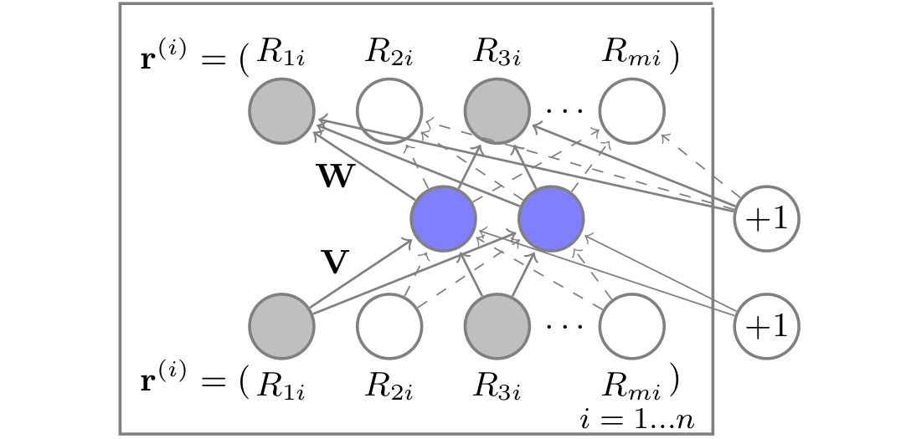

# AutoRec——单隐层神经网络推荐模型

---

> 2015年由澳大利亚国立大学提出，将自编码器的思想和协同过滤结合，提出了单隐层神经网络推荐系统模型, 模型结构简洁，清晰易懂 \
> *Sedhain S, Menon A K, Sanner S, et al. Autorec: Autoencoders meet collaborative filtering[C]//Proceedings of the 24th international conference on World Wide Web. 2015: 111-112.*

## 基本原理

AutoRec是一个标准的自编码器，基本原理是利用协同过滤中的共现矩阵，完成对物品向量或者用户向量的自编码，再利用自编码的结果得到用户对物品的预估分数，进而进行排序推荐。

假设有$m$个用户，$n$个标的物，则可以构建用户行为矩阵即共现矩阵$R \in \mathbb{R}^{m\times n}$,对于物品i，可以形成一个m维的向量$r^{(i)}$，即可构建自编码器$h(r;\theta)$。

## 网络结构



$V$和$W$分别表示输入层到隐藏层，隐藏层到输出层的参数矩阵，整个网络可以表达为：
$$
h(r;\theta) = f(W\cdot g(Vr+\mu) +b)
$$
其中f和g分别是激活函数，为了防止过拟合，加入L2正则化项，则目标函数为：
$$
min_{\theta}\sum_{i=1}^{n}||r^{(i)} - h(r^{(i)};\theta)||_{\mathcal{O}}^2 + \frac{\lambda}{2}\cdot (||W||_F^2+||V||_F^2)
$$
$||\cdot||_F$为Frobenius范数, 即矩阵的所有元素平方和再开方

## 推荐过程

直接将标的物i的评分向量$r^{(i)}$输入网络，得到的结果极为所有用户对物品i的评分预测，可根据预测结果进行排序

AutoRec也分为基于物品的I-AutoRec和基于用户的U-AutoRec,U-AutoRec可能会由于用户向量的稀疏性影响模型效果。

## 特点与局限

AutoRec其实是想泛化用户或物品评分，但由于结构简单，存在表达能力不足的问题

> [!NOTE]
> 共现矩阵的缺失值在训练时 用均值或者某一个固定值填充，在计算loss的时候这部分会被mask掉，在测试的时候输出的共现矩阵会使用这些预测的缺失值。


## 代码实现

```python
import torch
import numpy as np
import torch.nn as nn

class AutoRec(nn.Module):
    """
    基于物品的AutoRec模型
    """
    def __init__(self, config):
        super(AutoRec, self).__init__()
        self._num_items = config['num_items']
        self._hidden_units = config['hidden_units']
        self._lambda_value = config['lambda']
        self._config = config

        # 定义编码器结构
        self._encoder = nn.Sequential(
            nn.Linear(self._num_items, self._hidden_units),
            nn.Sigmoid()
        )
        # 定义解码器结构
        self._decoder = nn.Sequential(
            nn.Linear(self._hidden_units, self._num_items)
        )

    def forward(self, input):
        return self._decoder(self._encoder(input))

    def loss(self, res, input, mask, optimizer):
        cost = 0
        temp = 0

        cost += ((res - input) * mask).pow(2).sum()
        rmse = cost

        for i in optimizer.param_groups:
            # 找到权重矩阵V和W，并且计算平方和，用于约束项。
            for j in i['params']:
                if j.data.dim() == 2:
                    temp += torch.t(j.data).pow(2).sum()

        cost += temp * self._config['lambda'] * 0.5
        return cost, rmse

    def recommend_user(self, r_u, N):
        """
        :param r_u: 单个用户对所有物品的评分向量
        :param N: 推荐的商品个数
        """
        # 得到用户对所有物品的评分
        predict = self.forward(torch.from_numpy(r_u).float())
        predict = predict.detach().numpy()
        indexs = np.argsort(-predict)[:N]
        return indexs

    def recommend_item(self, user, test_r, N):
        """
        :param r_u: 所有用户对物品i的评分向量
        :param N: 推荐的商品个数
        """
        # 保存给user的推荐列表
        recommends = np.array([])

        for i in range(test_r.shape[1]):
            predict = self.forward(test_r[:, i])
            recommends.append(predict[user])

        # 按照逆序对推荐列表排序，得到最大的N个值的索引
        indexs = np.argsot(-recommends)[:N]
        # 按照用户对物品i的评分降序排序吗，推荐前N个物品给到用户
        return recommends[indexs]
```